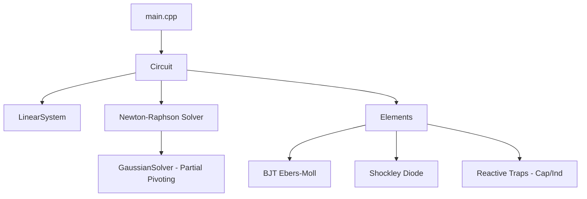

# API312 / 2520 Discrete Circuit Simulation

This project implements a high-fidelity analog circuit simulator based on **Modified Nodal Analysis (MNA)** and **Newton-Raphson** iteration, specifically tuned for the **API 2520** discrete op-amp and the **API 312** microphone preamp.

## Architecture

The simulator is built with the following core components:



### Key Features
- **MNA Engine**: Handles arbitrary topology of linear and non-linear elements.
- **Robust BJT Modeling**: Transport-model Ebers-Moll for numerical stability.
- **Dynamic Analysis**: Transient simulation using Trapezoidal integration.
- **Plausibility Guardrails**: Automatic validation of physical operating points (Vbe, Saturation, Temp-independent metrics).

## Build Instructions

### Prerequisites
- C++17 compliant compiler (GCC 9+, Clang 10+, MSVC 2019+)
- CMake 3.15+

### Build Steps
```bash
mkdir build && cd build
cmake ..
make -j4
```

## Usage

### Running the Op-Amp Validation
```bash
./main
```

### Running Test Suite
```bash
ctest --output-on-failure
```

## Planned Features (Roadmap)
- [ ] Phase 2: supply sweep and formal plausibility reports.
- [ ] Phase 3: Damped Newton-Raphson and Linear Solver stabilization.
- [ ] Phase 4: THD measurement and non-ideal transformer modeling.
- [ ] Phase 5: Real-time parameter smoothing (lock-free).
